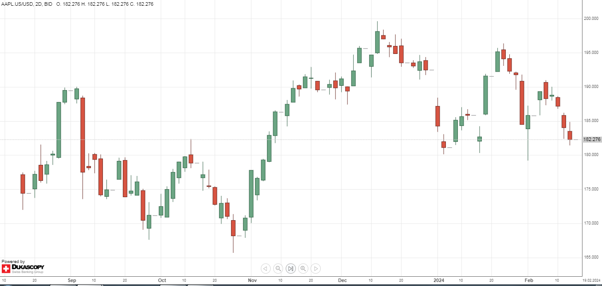
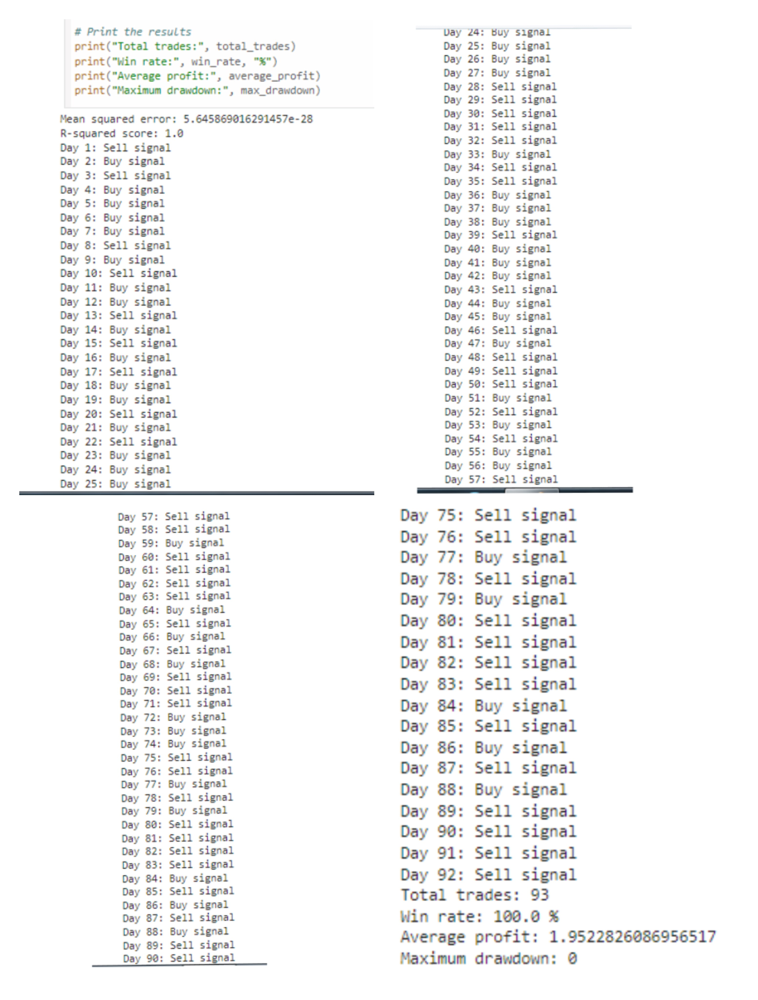

# Stock Price Prediction and Trading Strategy using Machine Learning with Python

This project utilizes machine learning techniques in Python to predict stock prices and implement a basic trading strategy.

# Chart Preview:



# Final Result :

The final result of the Stock Price Prediction and Trading Strategy using Machine Learning with Python has been displayed below ,



# Technical Report

The project has been published as an technical report in **Open Science Framework**, to which the link is provided below.  
        
                        https://osf.io/zj4b3/?view_only=cb6705ac505e4f769e82b25ec0bf5b6c

# Citation

For now, cite the [Open Science Framework paper](https://osf.io/zj4b3/?view_only=cb6705ac505e4f769e82b25ec0bf5b6c):

```bibtex
@misc{vasudevan2024stockprice,
      title={Stock Price Prediction and Trading Strategy using Machine Learning with Python}, 
      author={Vasudevan Swornampillai},
      year={2024},
      month={February},
      publisher={Open Science Framework},
      doi={DOI 10.17605/OSF.IO/ZJ4B3}
}
```

# Key Features:

**Data Preparation**: Extracts relevant features from historical stock data.

**Model Training**: Trains a linear regression model to predict closing prices.

**Model Evaluation**: Evaluates the model's performance using mean squared error and R-squared score.

**Model Saving**: Saves the trained model for future use.

**Trading Strategy**: Implements a simple trading strategy based on the model's predictions.

# Getting Started:

**Install Dependencies**: Install the required Python libraries listed in the requirements.txt file.

**Prepare Data**: Load your historical stock data into a Pandas DataFrame.

**Train Model**: Run the code provided in the model_training.py script to train the linear regression model.

**Evaluate Model**: Analyze the model's performance metrics to assess its effectiveness.

**Implement Trading Strategy**: Use the trained model to make predictions on new data and execute trades based on those predictions.

# Prerequisites:

Python 3.x 

Pandas library

scikit-learn library

joblib library

# Disclaimer:

Trading stocks involves significant financial risks and is not suitable for all investors. This project provides a basic framework for stock price prediction and trading strategy implementation, but it does not guarantee profits. Use this information at your own discretion.

# Installation:

1. Clone this repository to your local machine:
 
              git clone https://github.com/your-username/automated_stock_trading_ml_model.git

2. Install the required Python libraries:
 
              pip install -r requirements.txt
# Usage:

1. Run the trading script:
 
              python automated_stock_trading_ml_model.py

2. The script will pull historical forex data for a particular stock, train the Linear Regression model, and start placing trades automatically based on the model's predictions.

# Tech Stack:

**Language** - Python 3.10.12

# License:

This project is licensed under the Apache License 2.0.


# Share with the community

If you find this project interesting or helpful, don't hesitate to share with your community! Let's learn and grow together! 


# Conclusion 

In this project, we’ve utilized machine learning techniques in Python to predict stock prices and implement a basic trading strategy. The model, a beacon of performance, awaits those go into the beautiful world of Python.
